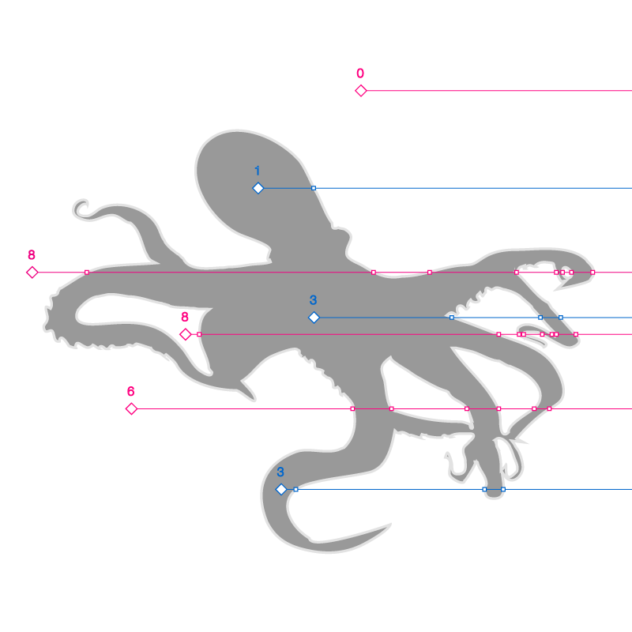
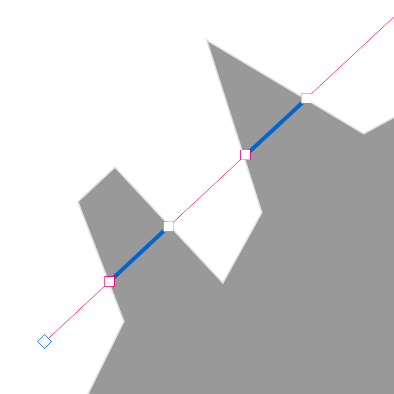
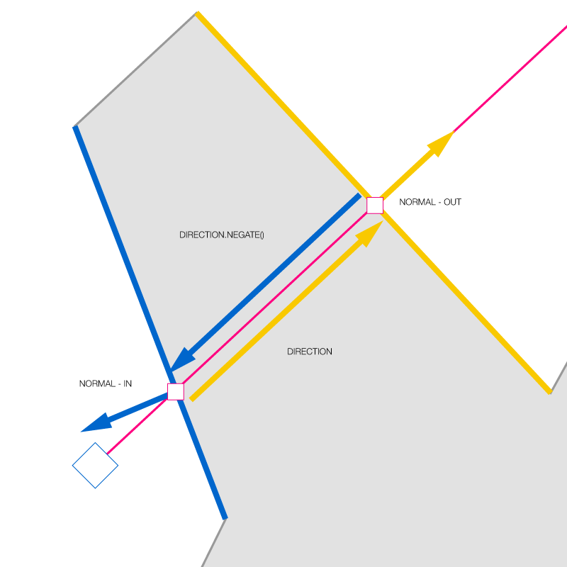
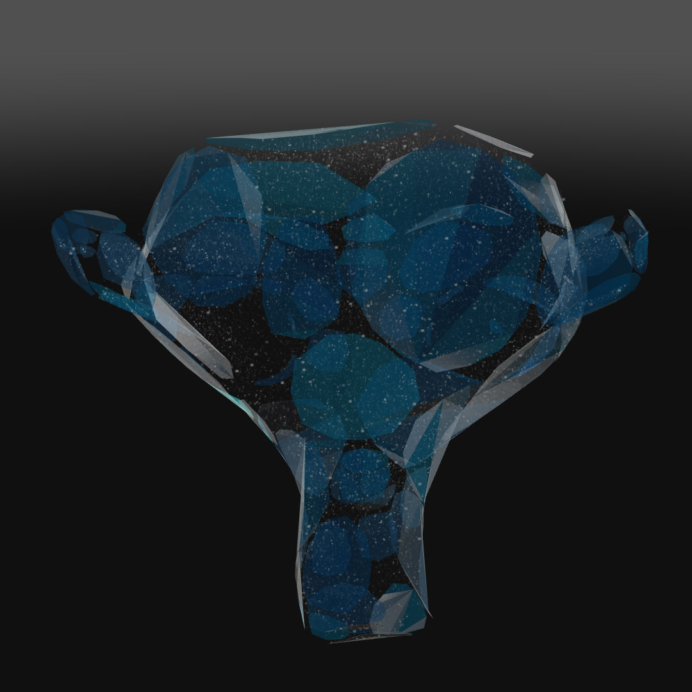
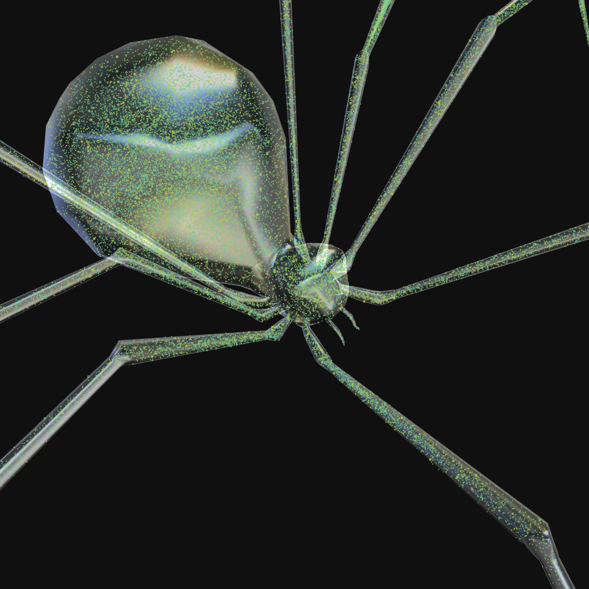
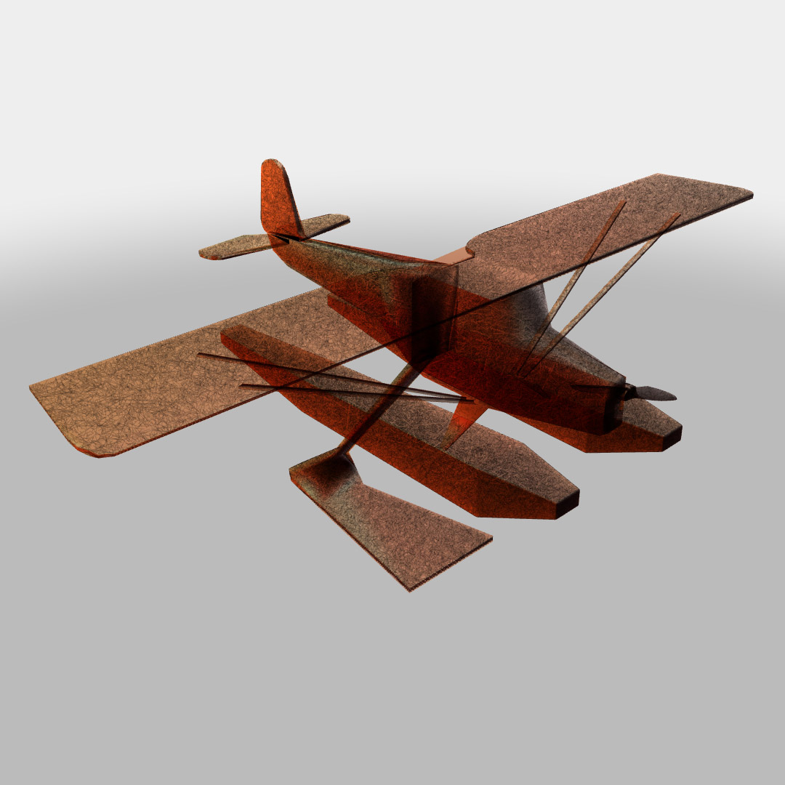
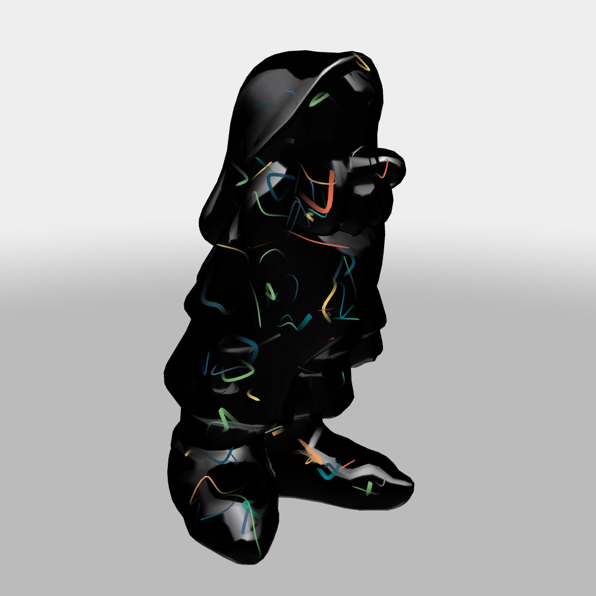

# volume distribution
distributing 3D vectors inside a mesh with THREE.js


this post and demos are also [available here](http://barradeau.com/blog/?p=1058)

the idea is to distribute (scatter) a set of random 3D points inside a volume, preferably an arbitrary mesh.

distributing random points in geometric volumes is quite straight forward. if you know the formula of a sphere, a cube, a cylinder or any shape, you can create a point inside the said shape. also, and much like Constructive Solid Geometry, it’s fairly easy to use boolean operations (union, subtraction, intersection & XOR) between the shapes and obtain a broad variety of complex shapes.

if this approach is elegant, probably fast and efficient, it has a big downside ; arbitrary meshes are hard – if not impossible – to model with equations. it is therefore often limited to simple use cases like procedural or fractals shapes.

being a long time 3DS max user, I often used the “Scatter” modifier to distribute point on or inside a mesh. when I used a non-manifold polyhedron – a “broken” mesh, with holes, no inside or outside – the modifier failed or 3DS crashed. that’s when I decided to try to code something.

the algorithm goes as follow:

 * pick a random point on the bounding volume of the mesh and a random direction
 * shoot a ray at the mesh from that origin, in that direction
 * evaluate the result to keep or discard the intersection points
it implies shooting many rays at a mesh so depending on the mesh’s complexity, it can take a lot of time and anyway it’s more suited as a mesh “pre-processor” than as a real time modifier.

step 1 is trivial, for step 2, THREE.js has a built-in raycaster and for step 3, we’ll mostly need to determine if we’re ‘inside’ or ‘outside’ the mesh.

to determine if a point is inside or outside a polyhedron, assuming the mesh is a manifold (it has an ‘inside’ and an ‘outside’), we can shoot a ray from that point in any direction and count how many times the ray intersects the polyhedron.

if the number is even, your point is outside, if it’s odd, it’s inside. a visual explanation:



I think it also works with actual octopuses but I would recommend not to try.

essentially, we’ll use the number of times a ray intersects the mesh to determine wether we’re inside or outside. here’s my implementation:

```javascript
var raycaster;//THREE.raycaster: used to shoot rays at the mesh
var o;//ray origin
var d;//ray direction
var intersections;//stores the result of the raycasting
var a;//DOM element tag to download the result ( see particlesToString )

function distribute( mesh, count ) {

    //this will store the results
    var coords = [];
    var dests = [];
    //temporary vars to store the position and destination
    var p0, p1;

    //this has an influence as to how the raycasting is performed
    var side = mesh.material.side;
    mesh.material.side = THREE.DoubleSide;

    //we'll need normals (it's probably done implicitly when we raycast though)
    mesh.geometry.computeFaceNormals();

    //this is used to distributte the origins of the rays
    mesh.geometry.computeBoundingBox();
    var bbox = mesh.geometry.boundingBox;

    // 'inflates' the box by 10% to prevent colinearity
    // or coplanarity of the origin with the mesh
    bbox.min.multiplyScalar( 1.1 );
    bbox.max.multiplyScalar( 1.1 );

    //computes the box' size to compute random points
    var size = bbox.max.sub( bbox.min );

    //to perform raycast
    raycaster = raycaster || new THREE.Raycaster();
    o = o || new THREE.Vector3();
    d = d || new THREE.Vector3();

    for( var i = 0; i < count; i++ ){

        // randomize the rays origin
        o.x = bbox.min.x + Math.random() * size.x;
        o.y = bbox.min.y + Math.random() * size.y;
        o.z = bbox.min.z + Math.random() * size.z;

        //randomize the ray's direction
        d.x = ( Math.random() - .5 );
        d.y = ( Math.random() - .5 );
        d.z = ( Math.random() - .5 );
        d.normalize();

        //sets the raycaster
        raycaster.set( o, d );

        //shoots the ray
        intersections = raycaster.intersectObject( mesh, false );

        //no result
        if( intersections.length == 0 ){

            //bail out & continue
            i--;

        }else{

            //checks if we meet the conditions:
            //the origin must be outside
            var valid = intersections.length >= 2 && (intersections.length % 2==0);
            if (valid) {

                //tests all the intersection pairs
                var additions = -1;
                for( var j = 0; j < intersections.length; j+= 2 ){

                    // make sure that the origin -> direction vector have the same
                    // direction as the normal of the face they hit

                    //test the direction against the outwards' face's normal
                    var dp0 = d.dot(intersections[ j + 1 ].face.normal) <= 0;

                    //flips the direction to make it 'look at' the origin
                    d.negate();

                    //test the direction against the inwards' face's normal
                    var dp1 = d.dot(intersections[ j ].face.normal) <= 0;

                    //flips the direction again for the next test
                    d.negate();

                    // if both vectors pairs head in the same direction
                    // the point is guarranteed to be inside
                    if( dp0 || dp1){
                        continue;
                    }

                    //adds the points
                    if( coords.length < count * 3 ){
                        console.log("ok")
                        p0 = intersections[j].point;
                        coords.push( p0.x, p0.y, p0.z);
                        p1 = intersections[j+1].point;
                        dests.push( p1.x, p1.y, p1.z);
                        additions++;
                    }
                }
                //increments the counter by the number of additions
                i += additions;

            }else{
                //invalid intersection, try again...
                i--;
            }
        }
    }
    //resets the material side
    mesh.material.side = side;
    return {
        pos:coords,
        dst:dests
    };
};
```
this is rather self-explanatory (hopefully) ; we get the bounding box of the mesh, ‘inflate’ it a bit to avoid some colinearity / coplanarity issues, then randomize the ray’s origin/direction. performa ray casting onto the mesh then classify the result.

let’s focus on the ‘classify’ bit a minute:


```javascript
//the origin must be outside
var valid = intersections.length >= 2 && ( intersections.length % 2 == 0 );
if (valid) {
[...]
```
we’re in a valid state if we have: at least 2 intersections and an even number of intersections which means that we hit the mesh at least once and our origin is outside the mesh ( as seen above with that glorious octopus illustration ). we have something like this when valid is true:
valid


the next bit takes all pairs of points and retrieves the associated normals like so:

and computes the dot product between the 2 vectors of the same color. if the dot product of 2 vectors is positive, they’re heading in the same direction, if the dot product is negative, they are heading in opposite directions and if it’s 0, they are perpendicular. this dreadful 4 liners will do this for all intersections pairs.

```javascript
//test the direction against the outwards' face's normal
var dp0 = d.dot(intersections[ j + 1 ].face.normal) <= 0;

//flips the direction to make it 'look at' the origin
d.negate();

//test the direction against the inwards' face's normal
var dp1 = d.dot(intersections[ j ].face.normal) <= 0;

//flips the direction again for the next test
d.negate();

// if both vectors pairs head in the same direction
// the point is guarranteed to be inside
if( dp0 || dp1){
    continue;
}
```
this ensures that the “broken polyhedra” work too ; if the 2 faces’ normals head in the same direction, the object is broken ; it has no inside or outside. the code above checks this case and bails out if need be. it can also collect more than 2 points per ray which is nice :)

you would call it like:

```javascript
var model = CHTHULU;//a THREE.Mesh
var count = Math.pow( 2, 12 );// -> 4096 point pairs

//call the method and strore the result in a prticles object
var inside = distribute( model, count );
```

the result of the distribute function is a pair of float32Arrays containing XYZ triplets for the in &  out positions respectively. to place an object ‘inside’ the polyhedron, you’d do something like:

```javascript
//midpoint of the 2 intersection points
var p = new THREE.Vector3(
    ( inside.pos[ id ].x + inside.dst[ id ].x ) * .5,
    ( inside.pos[ id ].y + inside.dst[ id ].y ) * .5,
    ( inside.pos[ id ].z + inside.dst[ id ].z ) * .5
);
```

or more likely, pass inside.dst as an attribute and ask the shader to mix the two:
```glsl
float t = abs( sin( time ) );
vec3 pos = mix( position, dest, t );
```

with a value t between 0 & 1 which guarantees that the position will remain inside the mesh.

of course we can change the above to ‘carve’ the mesh inside a cloud of points and keep only the “outside”. :)

HAMMER TIME!
this is a model with 65K particles floating around (click)

[](http://www.barradeau.com/2017/volume/suzanne.html)

if you notice some particles floating around, it’s because the distribution mesh is the mother of all non-manifold polyhedra ^^


this is again 65K particles distributed inside a mesh. notice how it retained the fine details (on the legs for instance)

[](http://www.barradeau.com/2017/volume/spider.html)

still 65K particles, this time rendered as line segments

[](http://www.barradeau.com/2017/volume/plane.html)

finally a splendid rendition of 2K particles as line sets, using the Spite’s MeshLines. my code is ugly as fuck but hey…

[](http://www.barradeau.com/2017/volume/dwarf.html)

and that’s it! well, I gues you get the idea ^^
enjoy :)